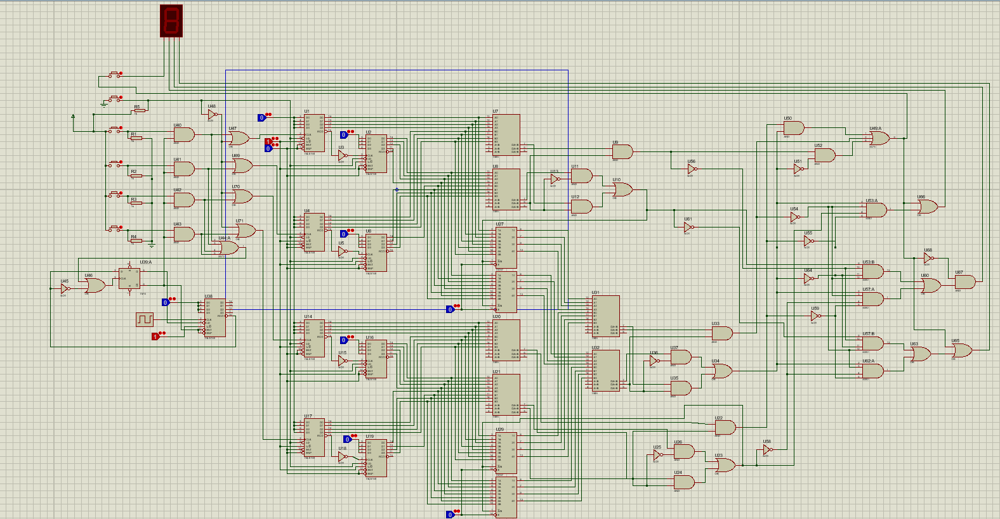
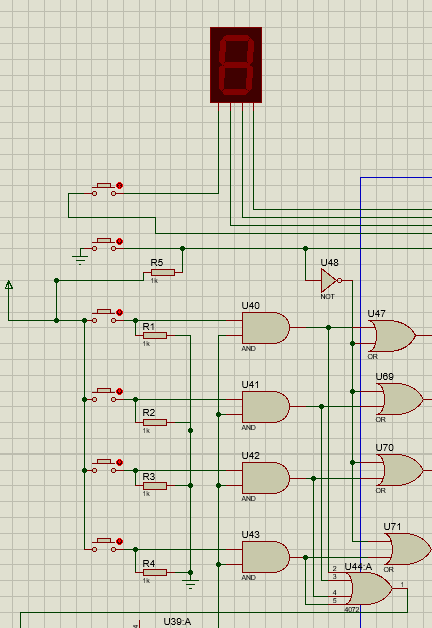
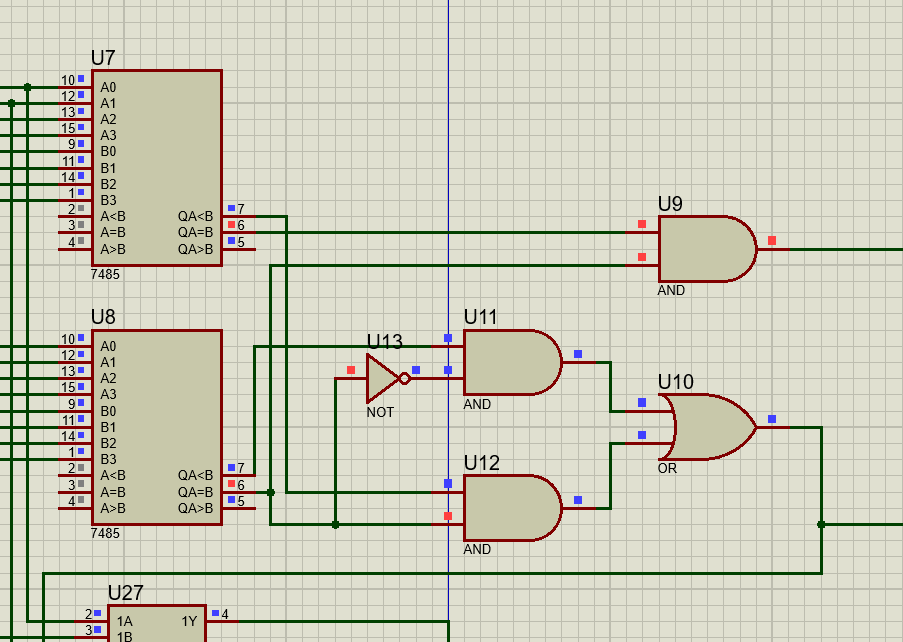

# EVM-machine-digital-circuit
Building and simulating EVM machine circuit in proteus. Four push buttons are used as input, there are two more push buttons one resets the machine and other displayes the winner or draw.

The 8 bit counter for each input is made up of two 4 bit counter. As a button is pressed it will increase it's count value. All counters are connected to reset button to clear it previous value.

The value stored in the counters is compared to declear the winner. As comparator can only compare two quantity, three comparator and two mux are used to all four counters.

The output of all comparator is given to logic gates which drive and display the result.

A button dissabling circuit is implemented to dissable the button for some time after pressing any input button.

